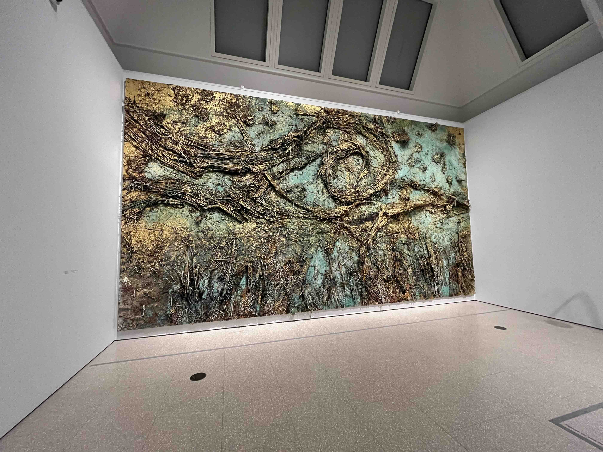

The exhibition is at the back of the RA, in 3 rooms. Each room has one or two enormous Kiefer canvasses, and a handful of his smaller works. There are a few Van Goghs, but they feel like they're there to provide context rather than take the spotlight.

The contrast between the two is stark. Kiefer's canvasses are imposing, textured, and opulent; Van Gogh’s are much more subdued. Both carry a sense of solitude, and capture the mystical quality of the landscapes they depict. I really loved everything.

The paintings were beautiful - when I could actually see them. This exhibition was not spared a few gallery selfieists. One had the temerity to tut at a lady for lingering too long while looking at Starry Night up close.

<figure class="post-image">
  
  <figcaption>Kieffer's Starry Night (sans selfieists)</figcaption>
</figure>

There's a gallery guide for £2.50. It has some diary entries from Kiefer at 18, when he received a travel bursary to follow Van Gogh's footsteps. He has a self aware and unaffected tone that was really endearing. It's a nice thing to read afterwards.

5/5

