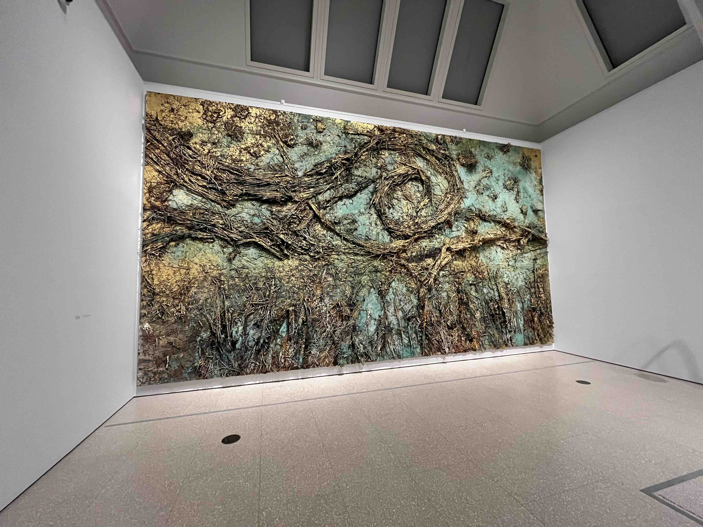

The exhibition is at the back of the RA, in 3 rooms. Each room has one or two enormous Kieffer canvasses, and a handful of his smaller works. There are a few Van Goghs, but they feel like they're there to provide context rather than take the spotlight.

The contrast between the two is stark. Kieffer's canvasses are imposing, textured, and opulent; the Van Gogh's works are much more subdued. Both carry a sense of solitude, and evoke the magic of the landscapes they paint. I really loved everything.

There's a gallery guide for £2.50. It has some diary entries from Kieffer at 18, when he received a travel bursary to follow Van Gogh's footsteps. It's a lovely read!

5/5

<figure class="post-image">
  
  <figcaption>Kieffer's Starry Night (sans selfieists)</figcaption>
</figure>
